# 코로나에 따른 항공수출데이터 분석

> - 노선별 항공수출운임 데이터와 코로나 확진자 데이터간의 변화 및 관계파악
> 
> - 지역별 항공물동량 데이터와 코로나 확진자 데이터간의 변화 및 관계 파악
> 
> - 평가 및 전망


---

## 활용데이터

1. 코로나 데이터(해외발생)
   
   - 출처
     
     - [WHO COVID-19 Data](https://covid19.who.int/data)
     
     - [공공데이터활용지원센터_보건복지부 코로나19해외발생 현황 | 공공데이터포털](https://www.data.go.kr/data/15043379/openapi.do))
   
   

2. 항공수출운임 데이터
   
   - 운임구간 : 인천공항출발을 기점으로 2014년 수출입물동량 상위 국가들의 주요 공항
   
   - 3개 지역 19개 공항
     
     - 미국 5개 공항: 아탈란타공항, 시카고공항, 뉴욕공항, 샌프란시스코공항, 로스앤젤레스공항
     
     - 유럽 1개 공항: 독일 프랑크푸르트 공항
     
     - 아시아 13개 공항 6개국가: 베이징공항, 항저우공항, 푸동공항, 칭따오공항, 톈진공항, 나리타공항, 나고야공항, 간사이공항, 호치민공항, 페낭공항, 쿠알라룸프루공항, 싱가포르공항, 홍콩공항
   
   - 항공수출운임단위 : USD/1톤
   
   - 기간 : 2018.01 ~ 2022.03
   
   - 출처 : [한국관세물류협회]([한국관세물류협회](https://www.kcla.kr/web/inc/html/4-2_1.asp?mode=search&flight_cate=%EC%88%98%EC%B6%9C&flight_port=Los+Angeles&flight_year_start=2015&flight_month_start=01&flight_year_end=2022&flight_month_end=01))
   
   

3. 항공물동량 데이터
   
   - 국제선 출발 + 도착 기준으로 각 지역별 물동량 상위국가 선정
   
   - 3개 지역 11개 국가
     
     - 미주 1개 국가 : 미국
     
     - 유럽 4개 국가 : 독일, 프랑스, 이탈리아, 러시아
     
     - 아시아 6개 국가 : 중국, 일본, 베트남, 말레이시아, 싱가포르, 홍콩
   
   - 항공물동량 단위 : 1톤
   
   - 기간 : 2018.01 ~ 2022.03
   
   - 출처 : [항공정보포털시스템(AirPortal)]([항공통계](https://www.airportal.go.kr/knowledge/statsnew/air/area.jsp#))
   
   
   
---

## 활용기술

- 활용 언어 : Python

- 크롤링 : BeautifulSoup, Selenium

- 데이터 전처리 및 가공 : Pandas

- 데이터 시각화 : MatplotLib

- 데이터 분석: SciPy

- Ad-Hoc 분석 : Jupyter Notebook

---

## 노선별 항공운임데이터와 코로나데이터간의 변화 및 관계 파악

- 장거리노선(미국, 독일 공항)과 단거리노선(아시아공항)으로 분리하여 데이터비교

- 코로나 전/후 항공수출운임의 추이

- 코로나 발생 후, 항공수출운임과 코로나 확진자 데이터의 추이

- 항공수출운임과 코로나 데이터간의 상관관계 분석

- 코로나 발생 전/후 1년간의 항공운임데이터를 이용해 쌍체표본 t검정 수행

---


### (장거리) 미국, 독일공항 코로나 전/후 월단위 항공수출운임 추이

- 2020년 2월을 코로나 발생 초기로 설정

- 코로나 발생 전 (2018~2020.01) 과 코로나 발생 후(2020.02~2022.03) 의 항공수출운임 데이터 비교

- 2020년 2월을 기점으로 장거리노선의 항공수출운임은 급격히 상승해 2022년 3월에는 코로나 이전의 3배이상을 기록 중

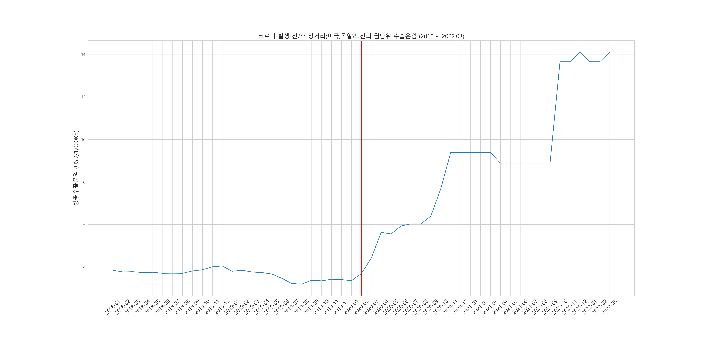

### (장거리) 미국, 독일공항 코로나 전/후 연도별 항공수출운임 추이

- 코로나 전/후 4년동안의 추이

- 항공수출운임은 2020년부터 급격하게 상승 중

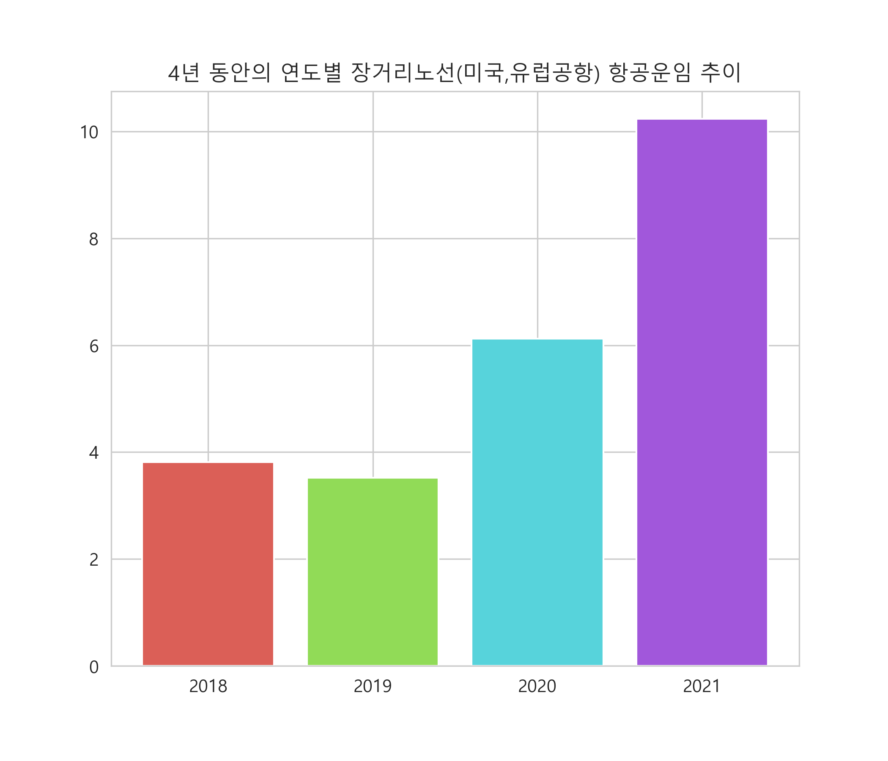

### (장거리) 코로나 발생 후, 항공수출운임과 코로나 확진자 데이터의 추이

- 미국,독일공항의 수출운임(파란색 선)

- 전세계 코로나 확진자(빨강색 선)

- 미국,독일 코로나 확진자(초록색 선)

- 3개의 구간에서 항공운임이 급격히 상승 (2020.02~2020.04 / 2020.09~2020.11 / 2021.09~2021.10)

- 마지막 구간(2021.09 ~ 2021.10) 은 코로나의 영향이 없는것으로 보임

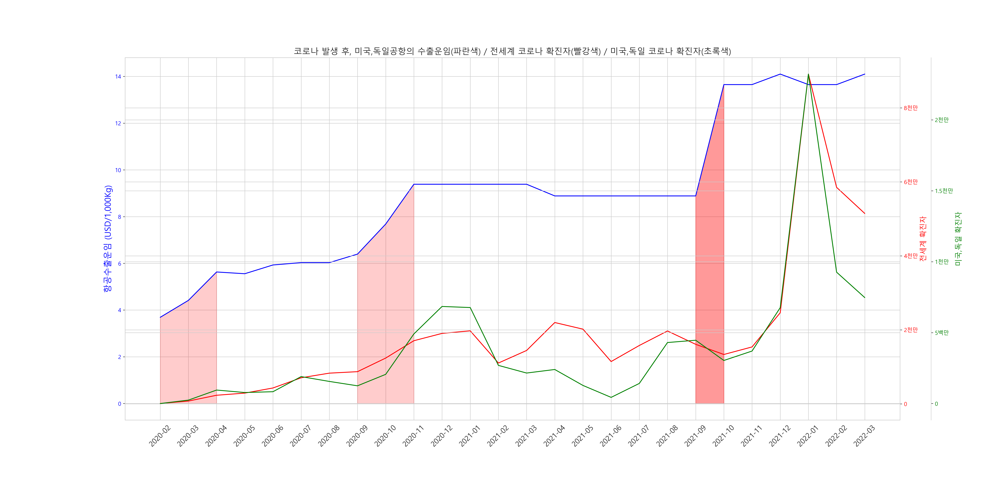

### (장거리) 미국,독일공항 항공수출운임과 코로나 데이터간의 상관관계 분석

- 항공수출운임과 전세계 확진자 수 간의 상관계수 : 0.7129

- 항공수출운임과 미국,독일 확진자 수 간의 상관계수 : 0.6369

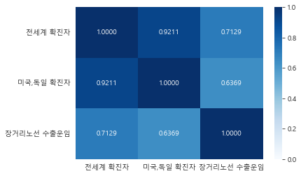

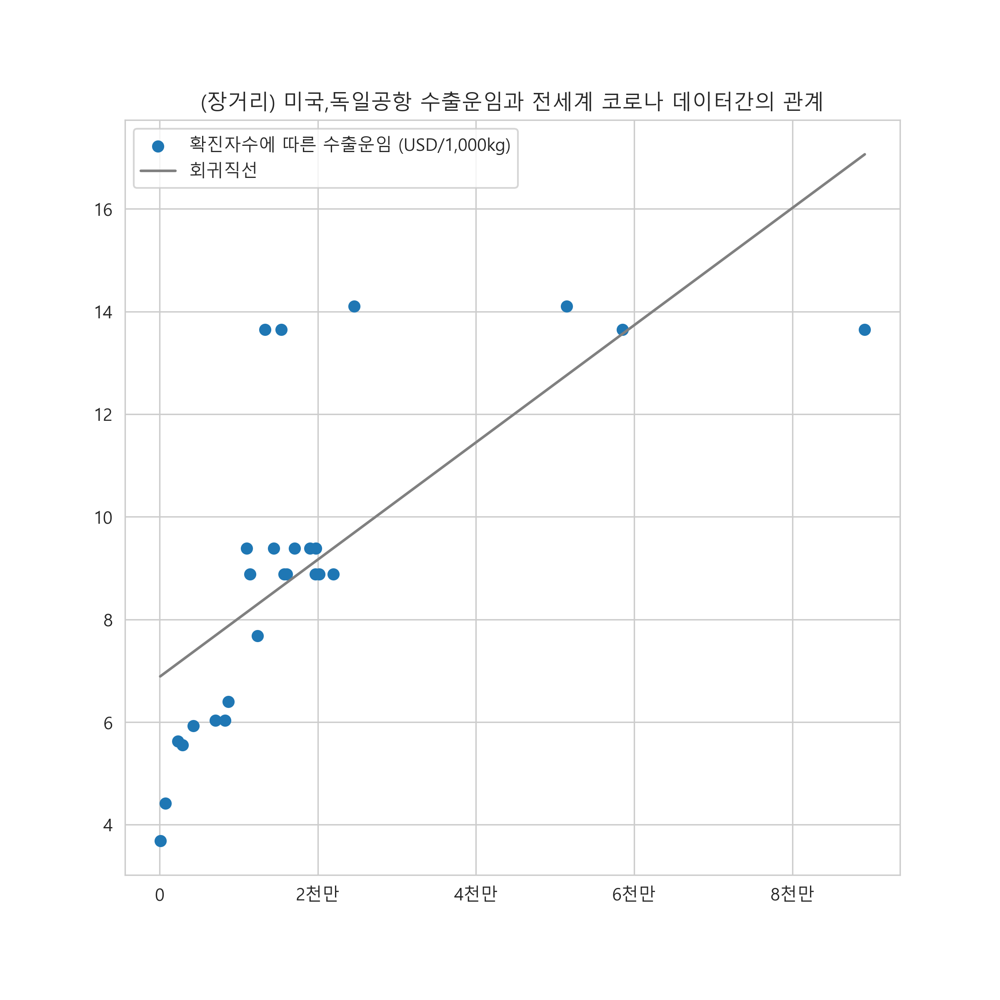

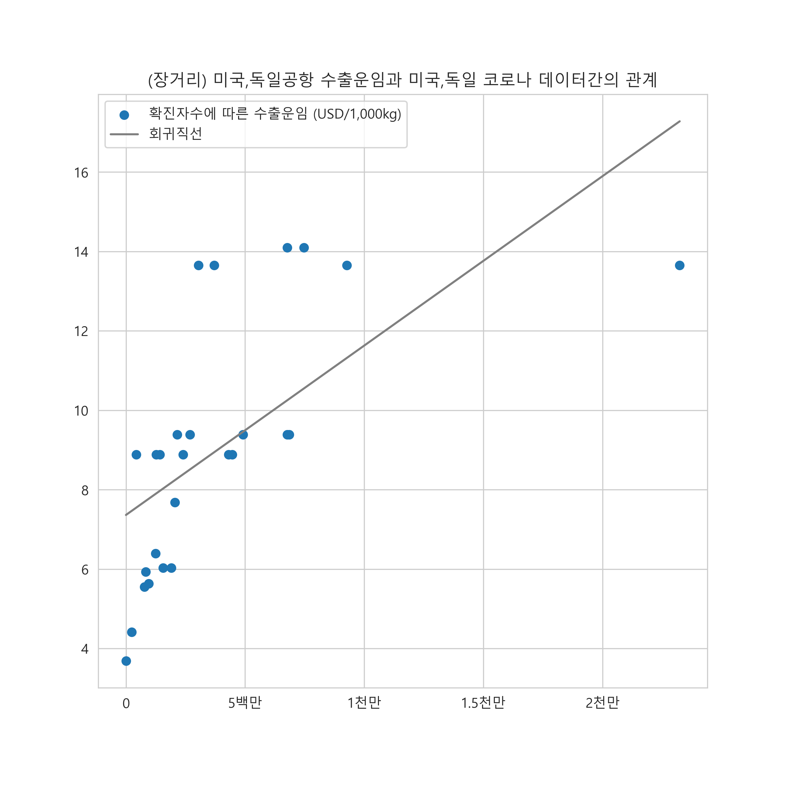

### (장거리) 코로나 발생 전/후 1년간의 항공운임데이터를 이용해 쌍체표본 t검정 수행

- 쌍체표본 t검정의 결론 : 장거리 노선의 항공운임은 코로나 이후 1년간 전년동월대비 증가함

```python
# 코로나 전(2019-02 ~ 2020-02) 장거리노선의 항공운임데이터
fare_long_before = df_fare_long_dis.loc['2019-02':'2020-02']['장거리평균'].values
# 코로나 후(2020-02 ~ 2021-02) 장거리노선의 항공운임데이터
fare_long_after = df_fare_long_dis.loc['2020-02':'2021-02']['장거리평균'].values
```

```python
# 집단간 차이에 대한 정규성 검정
# 귀무가설 : 집단간 차이는 정규성을 띈다
# 대립가설 : 집단간 차이는 정규성을 띄지 않는다
shapiro(fare_long_after-fare_long_before)  
# ShapiroResult(statistic=0.913183331489563, pvalue=0.20270603895187378)
# pvalue가 0.05보다 크므로 귀무가설 채택 -> 정규성을 띈다
```

```python
# 귀무가설: 코로나로 인한 항공운임의 변화가 없음
# 대립가설 : 코로나로 인해 항공운임이 증가함
ttest_rel(fare_long_after, fare_long_before)  
# Ttest_relResult(statistic=5.740070754189229, pvalue=9.307349228401051e-05)
# pvalue가 0.05 보다 작으므로 귀무가설을 기각 -> 코로나로 인한 항공운임의 변화가 있음
# 장거리노선으로의 항공운임은 코로나로 인해 증가함
```

---

### (중/단거리) 아시아공항 코로나 전/후 월 단위 항공수출운임 추이

- 2020년 2월부터 2021년 8월까지 중/단거리 노선의 항공수출운임은 지속적으로 상승

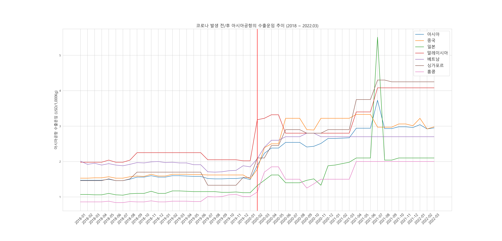

### (중/단거리) 아시아공항 코로나 전/후 연도별 항공수출운임 추이

- 코로나 전/후 4년동안의 추이

- 항공수출운임은 2020년부터 급격하게 상승 중

- 2021년 운임은 코로나 전 운임의 약 2배 정도

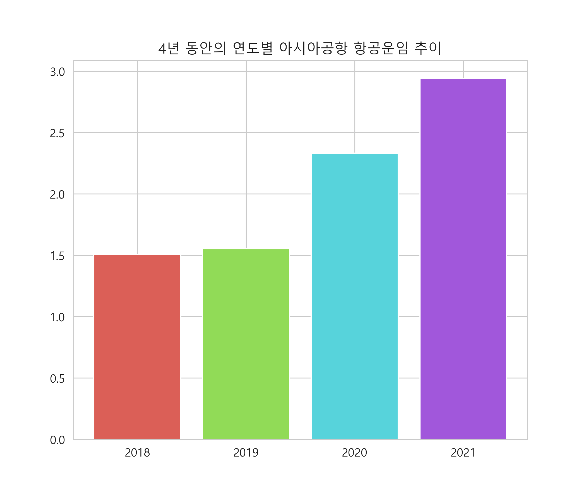

### (중/단거리) 코로나 발생 후, 항공수출운임과 코로나 확진자 데이터의 추이

- 아시아공항의 수출운임(파란색 선)

- 전세계 코로나 확진자(빨강색 선)

- 아시아 코로나 확진자(초록색 선)

- 항공수출운임은 2020.02~2021.04의 구간에서 지속적으로 상승

- 2021.06~2021.07 의 구간에서 급격히 상승하고 내려옴 : 일본공항의 항공운임의 급격한 상승이 원인으로 보임

- 2021.07 이후부터는 더 이상 증가하지 않고 있음

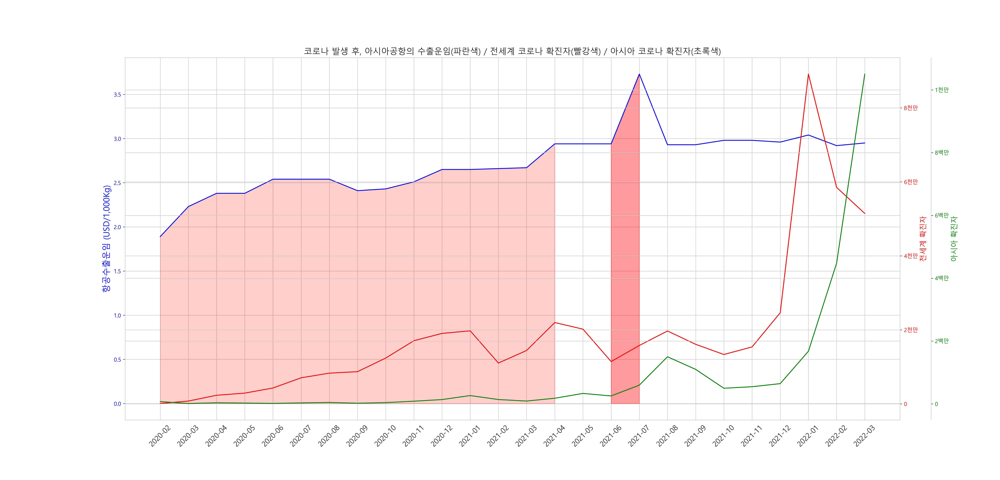

### (중/단거리) 아시아공항 항공수출운임과 코로나 데이터간의 상관관계 분석

- 항공수출운임과 전세계 확진자 수 간의 상관계수 : 0.4655

- 항공수출운임과 아시아 확진자 수 간의 상관계수 : 0.2819

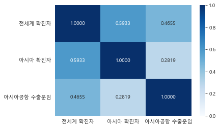

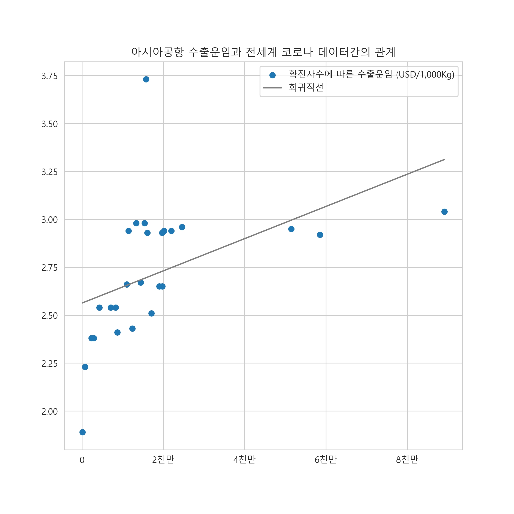

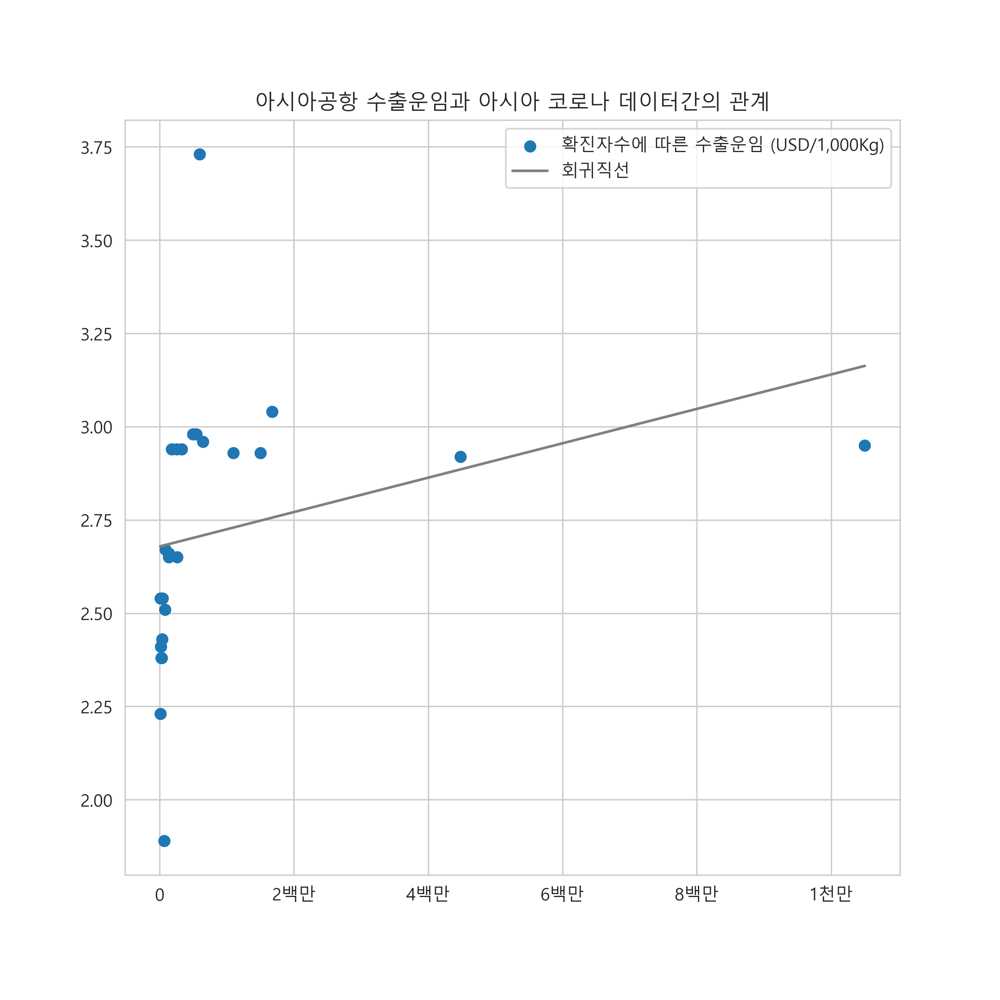

### (중/단거리) 코로나 발생 전/후 1년간의 항공운임데이터를 이용해 쌍체표본 t검정 수행

- 쌍체표본 t검정의 결론 : 중/단거리 노선의 항공운임은 코로나 이후 1년간 전년동월대비 증가함

```python
# 코로나 전(2019-02 ~ 2020-02) 중/단거리노선의 항공운임데이터
fare_asia_before = df_fare_asia_fin.loc['2019-02':'2020-02']['아시아공항'].values
# 코로나 전(2020-02 ~ 2021-02) 중/단거리노선의 항공운임데이터
fare_asia_after = df_fare_asia_fin.loc['2020-02':'2021-02']['아시아공항'].values
```

```python
# 집단간 차이에 대한 정규성 검정
# 귀무가설 : 집단간 차이는 정규성을 띈다
# 대립가설 : 집단간 차이는 정규성을 띄지 않는다
shapiro(fare_asia_after-fare_asia_before)  
# ShapiroResult(statistic=0.8975467681884766, pvalue=0.12375548481941223)
# pvalue가 0.05보다 크므로 귀무가설 채택 -> 정규성을 띈다
```

```python
# 귀무가설: 코로나로 인한 항공운임의 변화가 없음
# 대립가설 : 코로나로 인해 항공운임이 증가함
ttest_rel(fare_asia_after, fare_asia_before)  
# Ttest_relResult(statistic=13.751777035334115, pvalue=1.045176025835997e-08)
# pvalue가 0.05 보다 작으므로 귀무가설을 기각 -> 코로나로 인한 항공운임의 변화가 있음
# 아시아공항으로의 항공운임은 코로나로 인해 증가함
```

---

## 지역별 항공물동량 데이터와 코로나데이터간의 변화 및 관계파악

- 3개의 지역(미주, 유럽, 아시아)로 분리하여 데이터 비교

- 코로나 전/후 항공물동량의 추이

- 코로나 발생 후, 항공물동량과 코로나 확진자 데이터의 추이

- 코로나 발생 전/후 1년간의 항공물동량를 이용해 쌍체표본 t검정 수행

---

### (미주) 코로나 전/후 월 단위 항공물동량 추이

- 2020년 2월 물동량이 감소한 이후, 2020년 5월부터 증가

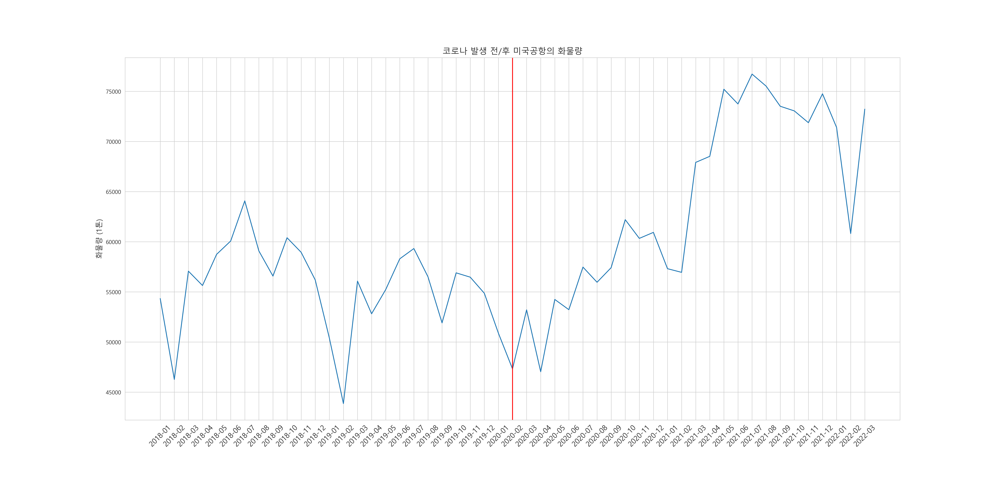

### (미주) 코로나 전/후 연도별 항공물동량 추이

- 2020년은 2019년과 비슷했고, 코로나 피크 기간이 껴있은 2021년 물동량이 오히려 증가

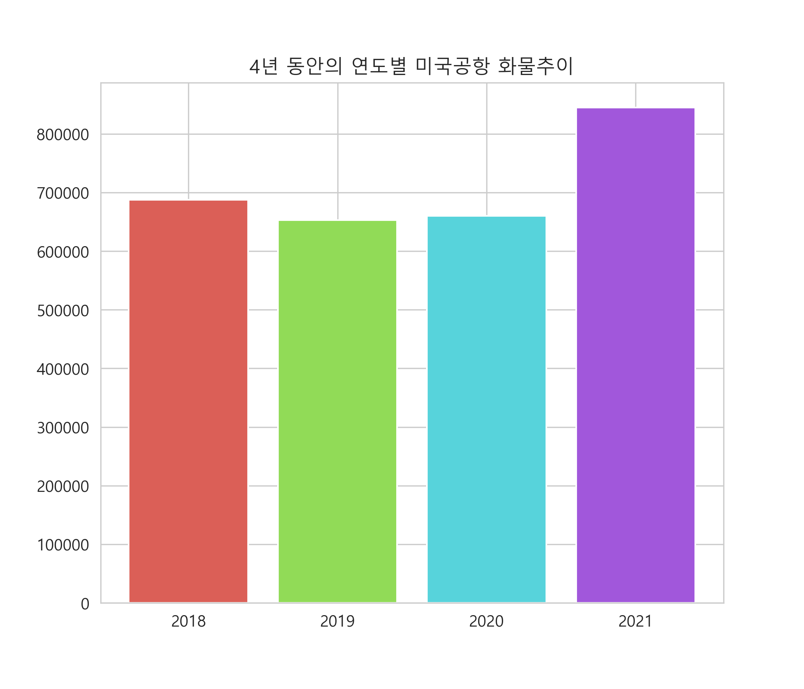

### (미주) 코로나 발생 후, 미국공항 물동량과 코로나 확진자 데이터의 추이

- 코로나 초기(2020.02 ~ 2020.03) 구간과 코로나 피크(2021.12 ~ 2022.02)구간에서 항공물동량 감소

- 나머지 구간에서는 코로나확진자가 증가함에 따라 물동량이 오히려 증가

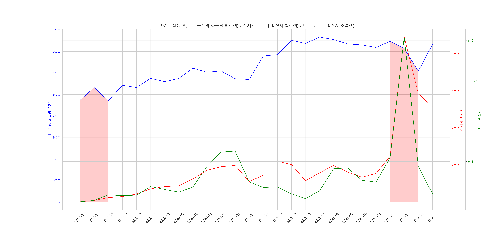

### (미주) 코로나 발생 전/후 1년간의 항공물동량을 이용해 쌍체표본 t검정 수행

- 쌍체표본 t검정의 결론 : 미주(미국) 지역의 항공물동량은 코로나로 인한 영향이 없고, 오히려 코로나 이후 항공화물량이 증가함

```python
# 코로나 전(2019-02 ~ 2020-02) 미국 항공화물량 데이터
df_cargo_america_before = df_cargo_america['2019-02':'2020-02'].values
# 코로나 후(2020-02 ~ 2021-02) 미국 항공화물량 데이터
df_cargo_america_after = df_cargo_america['2020-02':'2021-02'].values
```

```python
# 집단간 차이에 대한 정규성 검정
# 귀무가설 : 집단간 차이는 정규성을 띈다
# 대립가설 : 집단간 차이는 정규성을 띄지 않는다
shapiro(df_cargo_america_after-df_cargo_america_before)  
# ShapiroResult(statistic=0.9395685195922852, pvalue=0.45133906602859497)
# pvalue가 0.05보다 크므로 귀무가설 채택 -> 정규성을 띈다
```

```python
# 귀무가설: 코로나로 인한 항공화물량의 변화가 없음
# 대립가설 : 코로나로 인해 항공화물량이 감소함
ttest_rel(df_cargo_america_after, df_cargo_america_before)  
# Ttest_relResult(statistic=1.3140170632576231, pvalue=0.2134055542258403)
# pvalue가 0.05 보다 크므로 귀무가설을 채택 -> 코로나로 인한 항공화물량의 변화가 없음
# 미국과의 항공물동량은 코로나로 인한 영향이 없고, 오히려 코로나 이후 항공화물량이 증가함
```

---

### (유럽) 코로나 전/후 월 단위 항공물동량 추이

- 독일의 경우 코로나 전과 비슷한 추이를 가짐

- 독일을 제외한 프랑스, 러시아, 이탈리아의 경우 코로나 이후 전체적인 물동량이 감소함

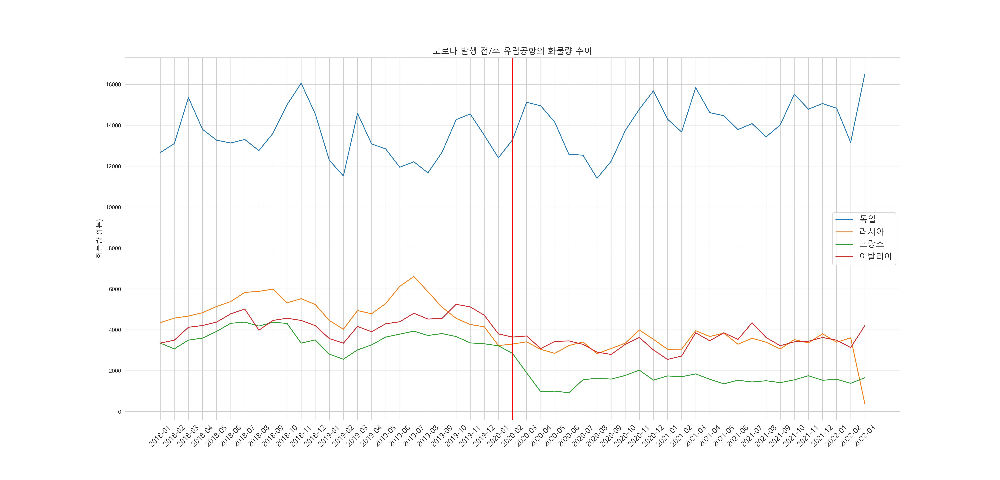

### (유럽) 코로나 전/후 연도별 항공물동량 추이

- 유럽 전체의 물동량으로 따지면, 코로나 이후 물동량이 감소한것을 확인할 수 있음

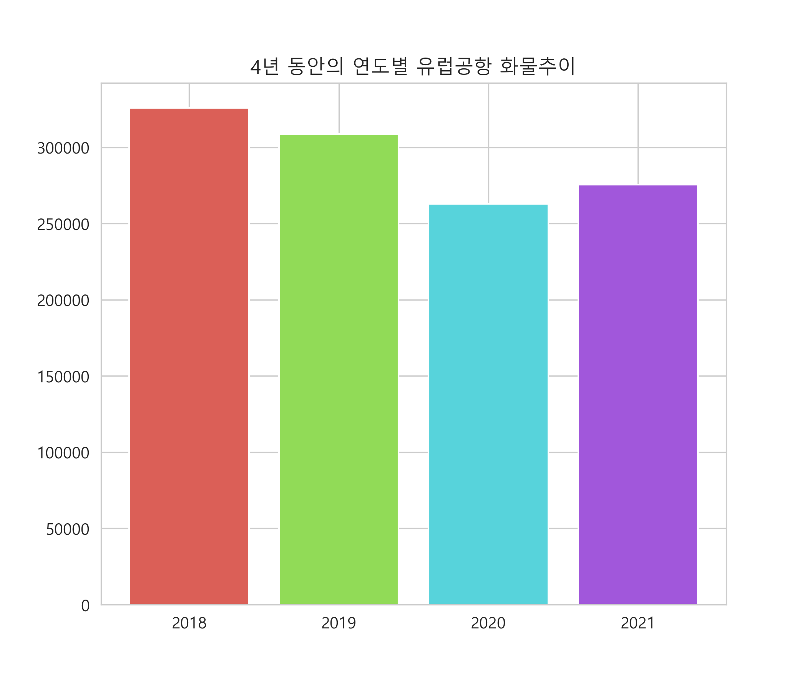

### (유럽) 코로나 발생 후, 유럽공항 물동량과 코로나 확진자 데이터의 추이

- 코로나 초기(2020.03 ~ 2020.08) 구간에서 물동량이 지속적으로 감소한 것을 확인

- 이후에는 코로나로 인한 큰 영향이 없는 것으로 보임

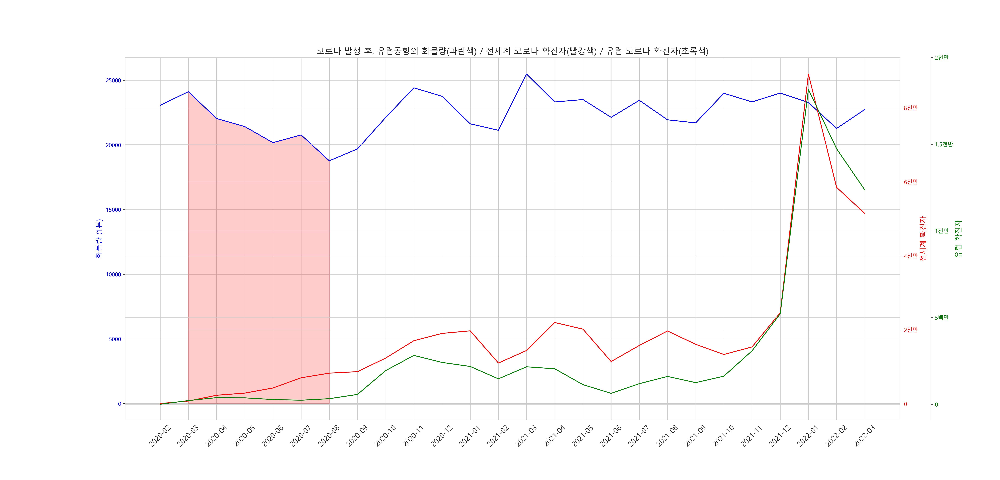

### (유럽) 코로나 발생 전/후 1년간의 항공물동량을 이용해 쌍체표본 t검정 수행

- 쌍체표본 t검정의 결론 : 유럽지역의 항공물동량은 코로나로 인한 영향이 있음

- 코로나 이후 1년간 전년동월대비 항공물동량이 감소함

```python
# 코로나 전(2019-02 ~ 2020-02) 유럽 항공화물량 데이터
df_cargo_europe_before = df_cargo_europe['유럽']['2019-02':'2020-02'].values
# 코로나 후(2020-02 ~ 2021-02) 유럽 항공화물량 데이터
df_cargo_europe_after = df_cargo_europe['유럽']['2020-02':'2021-02'].values
```

```python
# 집단간 차이에 대한 정규성 검정
# 귀무가설 : 집단간 차이는 정규성을 띈다
# 대립가설 : 집단간 차이는 정규성을 띄지 않는다
shapiro(df_cargo_europe_after-df_cargo_europe_before)  
# ShapiroResult(statistic=0.9326276183128357, pvalue=0.36871102452278137)
# pvalue가 0.05보다 크므로 귀무가설 채택 -> 정규성을 띈다
```

```python
# 귀무가설: 코로나로 인한 항공화물량의 변화가 없음
# 대립가설 : 코로나로 인해 항공화물량이 감소함
ttest_rel(df_cargo_europe_after, df_cargo_europe_before)  
# Ttest_relResult(statistic=-5.099697320000249, pvalue=0.00026193488611420845)
# pvalue가 0.05보다 작으므로 귀무가설을 기각 -> 코로나로 인해 항공화물량의 변화가 있음
# 통계량이 음수 : 코로나로 인해 항공화물량이 감소함--
```

---

### (아시아) 코로나 전/후 월 단위 항공물동량 추이

- 모든 아시아 국가들에서 항공물동량이 코로나 이후(2020.02 ~ )로 감소함

- 특히 중국의 물동량의 감소율이 눈에 띔

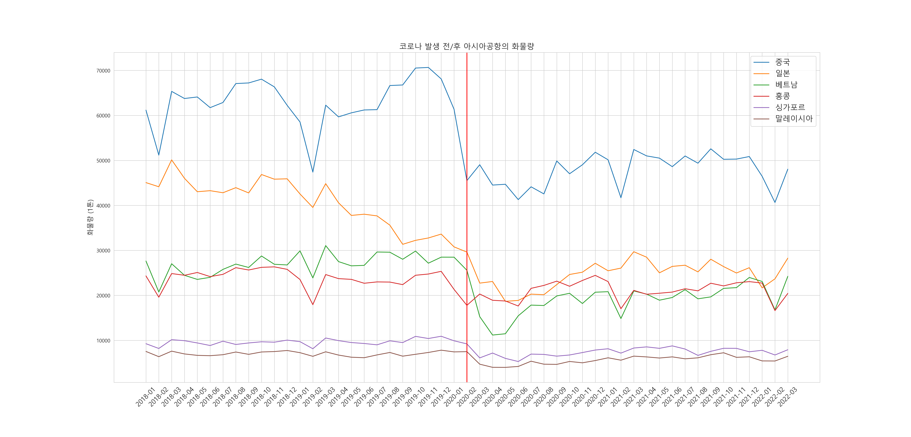

### (아시아) 코로나 전/후 연도별 항공물동량 추이

- 코로나 이후 물동량이 급감한것을 확인할 수 있음

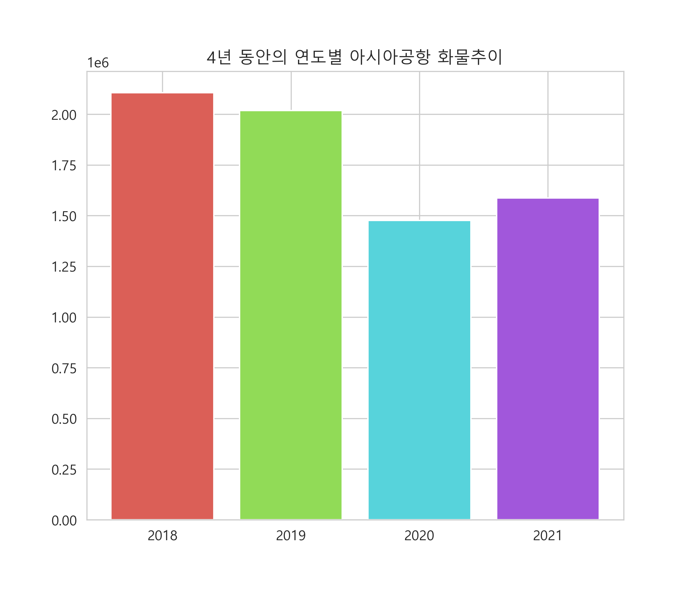

### (아시아) 코로나 발생 후, 아시아공항 물동량과 코로나 확진자 데이터 추이

- 코로나 초기(2020.02 ~ 2020.06) 구간에서 물동량이 지속적으로 감소한 것을 확인

- 2021.12 ~ 2022.02 구간에서 확진자가 급증함에 따라 물동량도 감소

- 2020.12 ~ 2021.02 구간의 물동량 감소는 원인불명

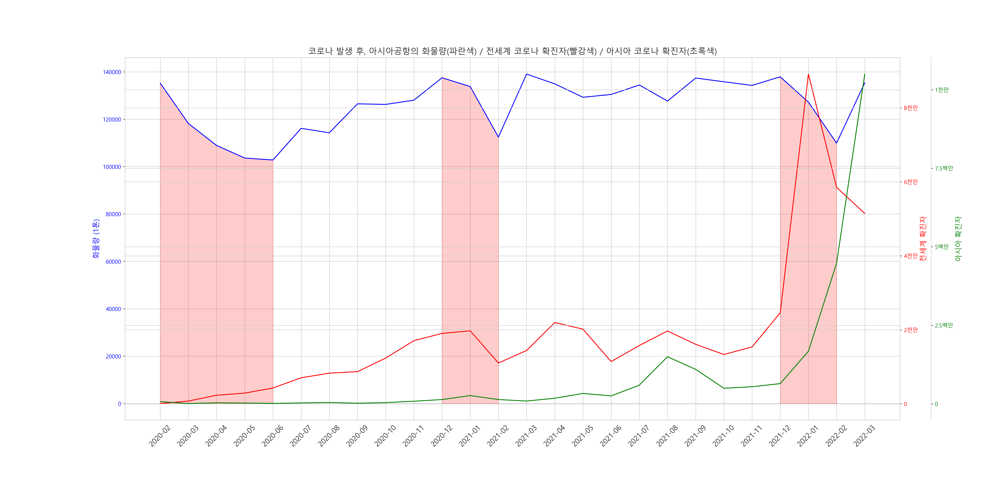

### (아시아) 코로나 발생 전/후 1년간의 항공물동량을 이용해 쌍체표본 t검정 수행

- 쌍체표본 t검정의 결론 : 아시아 지역의 항공물동량은 코로나로 인한 영향이 있음

- 코로나 이후 1년간 전년동월대비 항공물동량이 감소함

```python
# 코로나 후(2019-02 ~ 2020-02) 아시아 항공화물량 데이터
df_cargo_asia_before = df_cargo_asia['아시아']['2019-02':'2020-02'].values
# 코로나 후(2020-02 ~ 2021-02) 아시아 항공화물량 데이터
df_cargo_asia_after = df_cargo_asia['아시아']['2020-02':'2021-02'].values
```

```python
# 집단간 차이에 대한 정규성 검정
# 귀무가설 : 집단간 차이는 정규성을 띈다
# 대립가설 : 집단간 차이는 정규성을 띄지 않는다
shapiro(df_cargo_asia_after-df_cargo_asia_before)
# ShapiroResult(statistic=0.9008469581604004, pvalue=0.1373559534549713)
# pvalue가 0.05보다 크므로 귀무가설 채택 -> 정규성을 띈다
```

```python
# 귀무가설: 코로나로 인한 항공화물량의 변화가 없음
# 대립가설 : 코로나로 인해 항공화물량이 감소함
ttest_rel(df_cargo_asia_after, df_cargo_asia_before)
# Ttest_relResult(statistic=-9.279627486430908, pvalue=7.983163910283864e-07)
# pvalue가 0.05보다 작으므로 귀무가설을 기각 -> 코로나로 인한 항공화물량의 변화가 있음
# 통계량이 음수 : 코로나로 인해 항공화물량이 감소함
```

---

## 평가 및 전망

### 항공수출운임

- (장거리노선) 
  
  - 장거리노선(미국,유럽)의 항공수출운임과 코로나 데이터 간에는 강한 양의 상관관계를 가짐
  
  - 즉, 코로나 확진자가 증가함에 따라 장거리노선의 수출운임 역시 증가
  
  - 장거리노선의 수출운임은 코로나 발생 이후 지속적으로 상승 후, 코로나 이전 수출운임의 약 3배정도를 유지하고 있으며 아직 회복되고 있지 않고 있음

- (중/단거리노선)
  
  - 중/단거리노선(아시아)의 항공수출운임과 코로나 데이터간에는 약한 양의 상관관계를 가짐

  - 코로나 기간 동안 항공수출운임은 코로나 이전 수출운임의 약 2배정도 상승
  
  - 코로나 발생 이후 수출운임은 지속적으로 상승하다가 2021년 하반기부터는 더 이상 증가하지 않고 있음

- 전망
  
  - 분석한 데이터에 따르면 2022년이후 코로나가 안정세에 접어들면서 항공운임 역시 안정세에 접어들 것이라 전망할 수 있지만,
  
  - 원/달러 환율이 1300원을 돌파했고, 금리가 가파르게 오르고 있으며, 국제유가 또한 가파른 상승세(두바이유 기준 2022년 전년대비 45% 상승)를 보이고 있다. 이는 수출기업의 수요에 영향을 줄 뿐만 아니라 유류할증료 인상등으로 이어진다고 볼 수 있음
  
  - 실제로 지난해 말부터 올해 초까지 우리나라 항공사뿐만 아니라 외항사도 유류할증료를 30%가량 올렸다.  출처 : 물류신문(http://www.klnews.co.kr)
  
  - 따라서 현재 상태에서 장기적으로 항공운임이 더 증가할 가능성은 높진 않지만, 단기적으로는 항공운임의 하락이 빠르지는 않을 것이라 전망

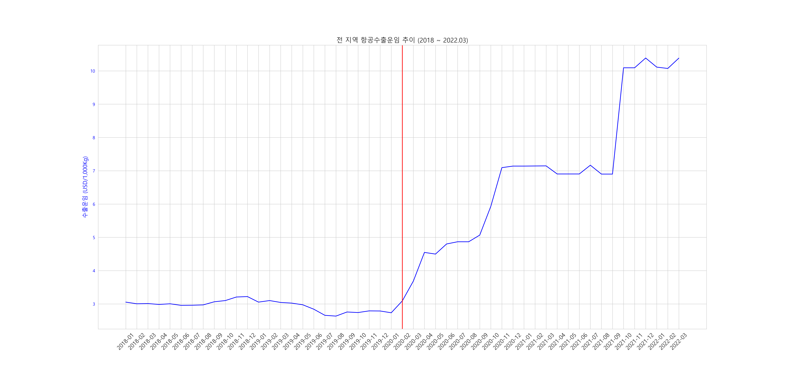

### 항공물동량

- (미주)
  
  - 미국공항은 코로나 발생 초기 물동량이 감소했다가, 이후 바로 상승곡선을 그리면서 코로나 전보다 더 많은 물동량을 보이고 있음
  
  - 다만, 미국코로나확진자와 전세계코로나확진자 수가 피크였던 2021년 12월 직후에는 급격한 감소를 보이면서 코로나가 항공물동량에 완전히 영향이 없지는 않다는 것을 보여주고 있음

- (유럽)
  
  - 코로나 발생 직후 물동량이 급격히 감소한 후, 시간이 지남에 따라 더 감소하는 것 없이 상태를 유지하고 있음
  - 연도별로 따지면, 전체적으로 코로나 전의 비해 감소함

- (아시아)
  
  - 유럽과 마찬가지로 코로나 발생 직후 물동량이 급격히 감소한 후, 시간이 지남에 따라 더 감소하는 것 없이 상태를 유지하고 있음
  - 연도별로 따지면, 전체적으로 코로나 전의 비해 감소함

- 전망
  
  - 코로나 발생 직후 급감했던 항공물동량이, 미국을 중심으로 점차 증가하고 있음
  
  - 하지만, 수출운임에서도 언급했듯이 항공물동량에는 환율, 금리, 국제유가, 전쟁 등 다양한 요인들이 영향을 미치기 때문에 코로나 전 만큼 회복할지는 미지수

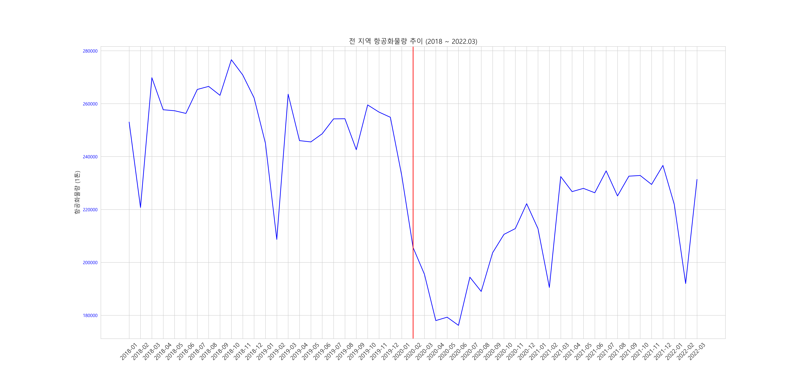
